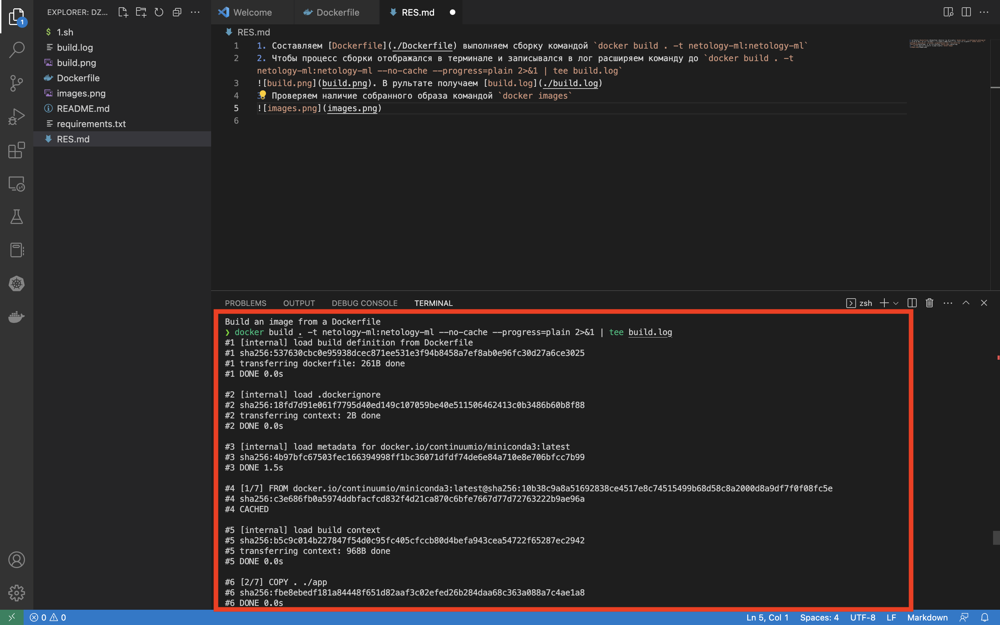
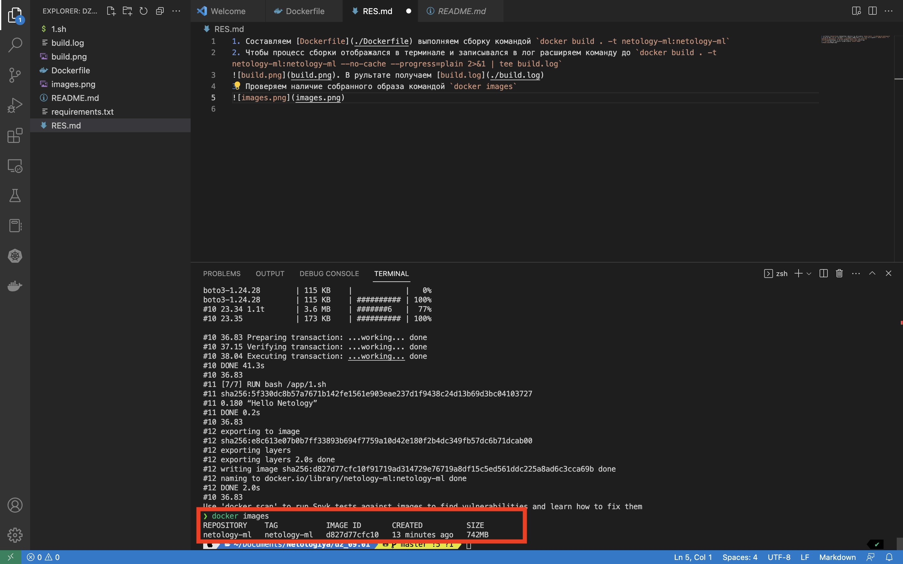

1. Составляем [Dockerfile](./Dockerfile) 
2. Если не нужен лог, выполняем сборку командой `docker build . -t netology-ml:netology-ml`
3. Но лог нужен. Следовательно, чтобы процесс сборки отображался в терминале и записывался в лог расширяем команду 
до `docker build . -t netology-ml:netology-ml --no-cache --progress=plain 2>&1 | tee build.log`

4. В рультате получаем [build.log](./build.log)
5. Проверяем наличие собранного образа командой `docker images`
