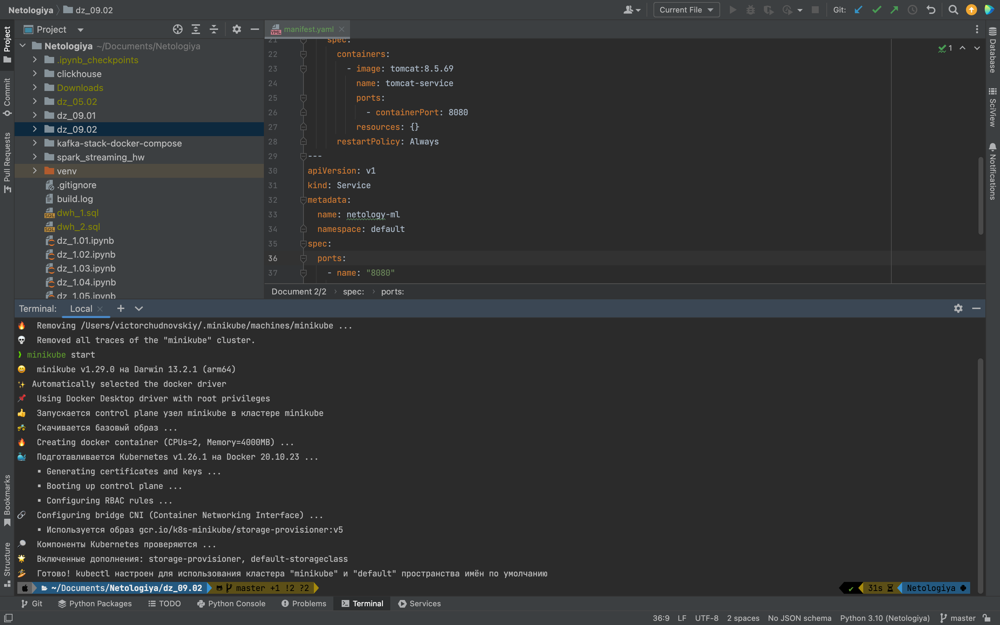
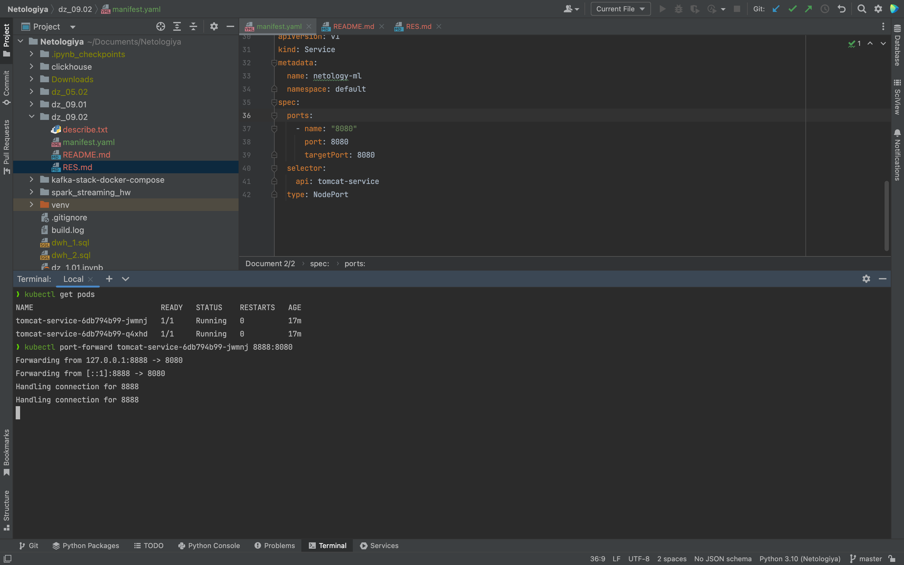
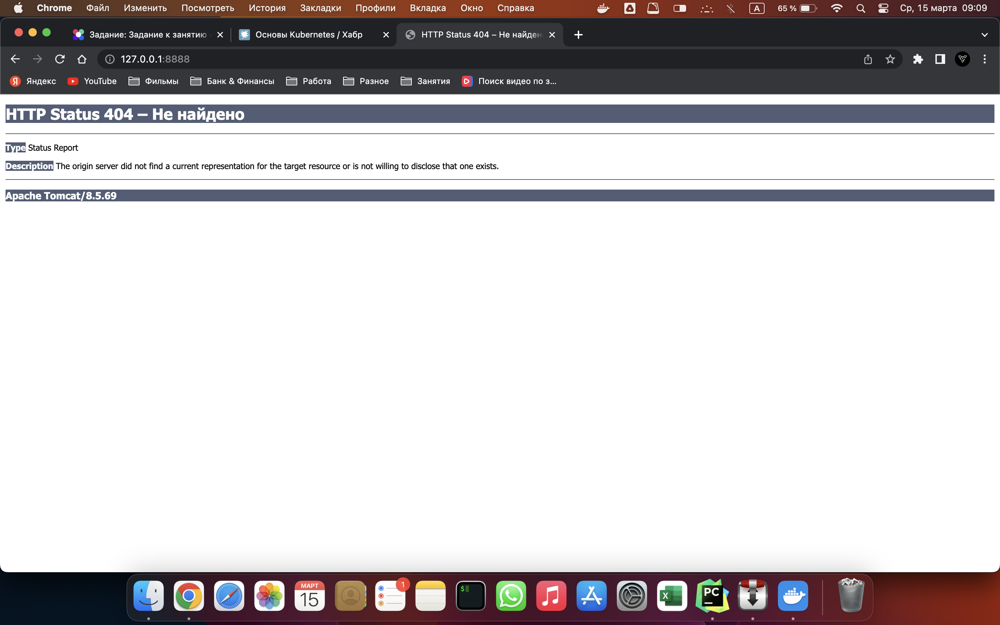

### Ответы на вопросы:
1. __Что такое k8s?__
    - Система оркестрации контейнеров, предназначенная для управления кластером контейнеров Linux как единой системой. Kubernetes управляет и запускает контейнеры Docker на большом количестве хостов, а так же обеспечивает совместное размещение и репликацию большого количества контейнеров
2. __В чём преимущество контейнеризации над виртуализацией?__  
    - Контейнеры меньше и требуют меньше ресурсов, чем виртуальные машины, поэтому контейнеры могут масштабироваться — создаваться или уничтожаться — гораздо быстрее, чем виртуальные машины. Контейнеры часто используются там, где требуются краткосрочные вычислительные экземпляры
3. __В чём состоит принцип самоконтроля k8s?__ 
    - Самоконтроль Kubernetes перезапускает отказавшие контейнеры, заменяет и завершает работу контейнеров, которые не проходят определенную пользователем проверку работоспособности и не показывает их клиентам, пока они не будут готовы к обслуживанию.
4. __Как вы думаете, зачем Вам понимать принципы деплоя в k8s?__ 
    - Когда есть контейнеры, работающие в продакшен, нужно, чтобы продакшен-окружение оставалось стабильным и отказоустойчивым. Если один из контейнеров падает, нужно, чтобы в любое время ему на замену был запущен другой. Kubernetes предоставляет платформу для отказоустойчивой работы распределенных систем — от масштабирования до аварийного переключения и балансировки нагрузки. 
5. __Какое из средств управления секретами наиболее распространено в использовании совместно с k8s?__
    - В Kubernetes есть такая сущность, как secrets, или секреты. Из названия понятно, что эти данные не могут быть общедоступными, и их нужно как-то защищать и особым образом доставлять в кластеры Kubernetes.  
6. __Какие типы нод есть в k8s, каковы их базовые функции?__  
    - Если __Cluster (кластер)__ - основной элемент k8s, то __Nodes (ноды)__ это то из чего состоит кластер или аналог серверов. Ноды бывают двух типов:  
      - Worker - сервер, на котором запускаются и работают контейнеры 
      - Mster - сервер, который управляет воркерами
    - Когда мы отправляем команды они присылаются на мастер ноды
    - Master Node - сервер, на котором работают три главных процесса: 
      - kube-apiserver
      - kebe-controller-manager
      - kube-scheduler
    - Worker Node - сервер, на котором работают процессы: 
      - kubelet
      - kube-proxy
    - Кластер всегда состоит хотя бы из одной мастер ноды

### Пошаговое исполнение:  
1. Устанавливаем minikube - кластер из 1 ноды и оболочку kubectl. `brew install minikube`, `brew install kubectl`. В качестве драйвера будем использовать docker
2. Запускаем кластер `minikube start` 
3. Можем даже зайти на кластер `minikube ssh` и поделать какие-нибудь команды, чтобы убедиться что все работает 
4. Собираем манифест файл [manifest.yaml](./manifest.yaml)
5. Запускаем deployment `kubectl apply -f manifest.yaml` и проверяем что поды созданы `kubectl get pods` 
6. Просмотрим полную информацию о подах `kubectl describe pods`. Для наглядности сохраним вывод в файл [describe.txt](./describe.txt)
7. Ради эксперимента перейдем внутрь пода и выполним там какую-нибудь команду, вывод даты например `kubectl exec tomcat-service-6db794b99-q4xhd -- date`. Все работает 
8. Для завершения эксперимента перенаправим порт контейнера 8080 на порт хоста 8888 `kubectl port-forward tomcat-service-6db794b99-jwmnj 8888:8080`. 
9. Посмотрим что будет по адресу __localhost:8888__ 