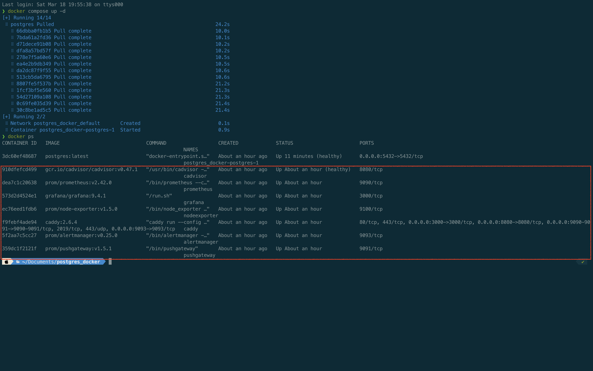
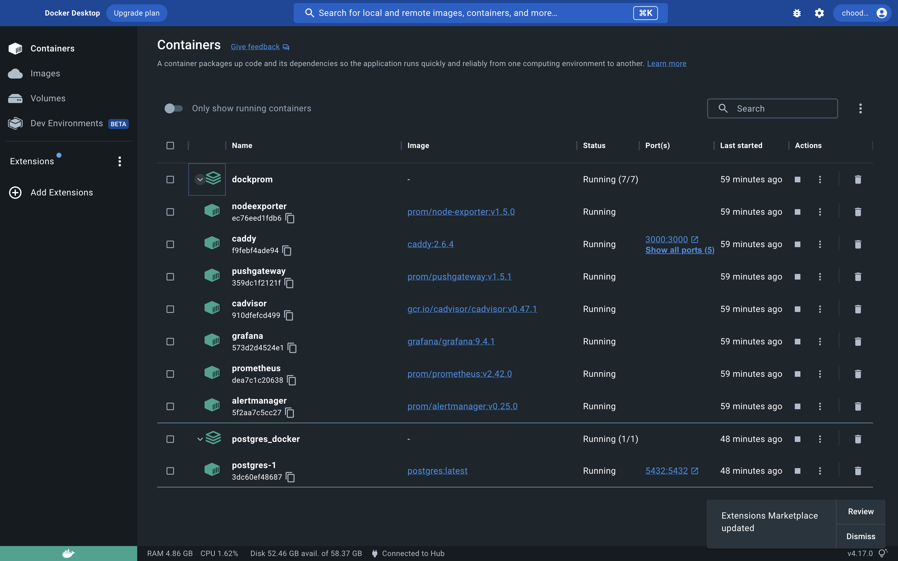
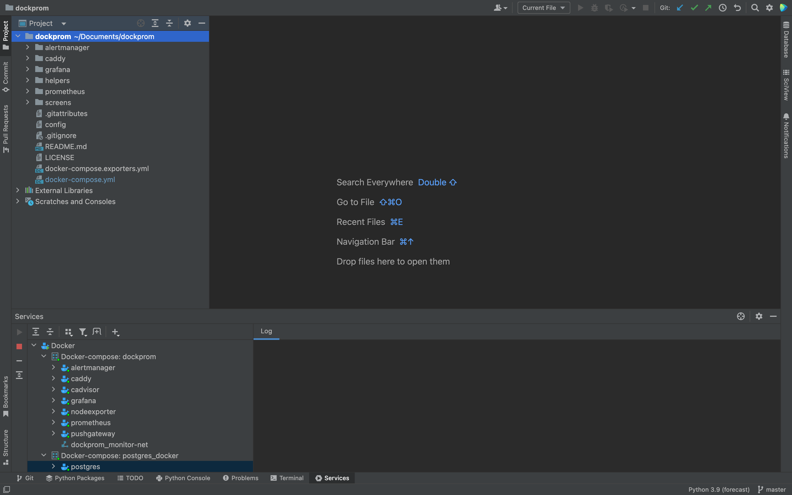
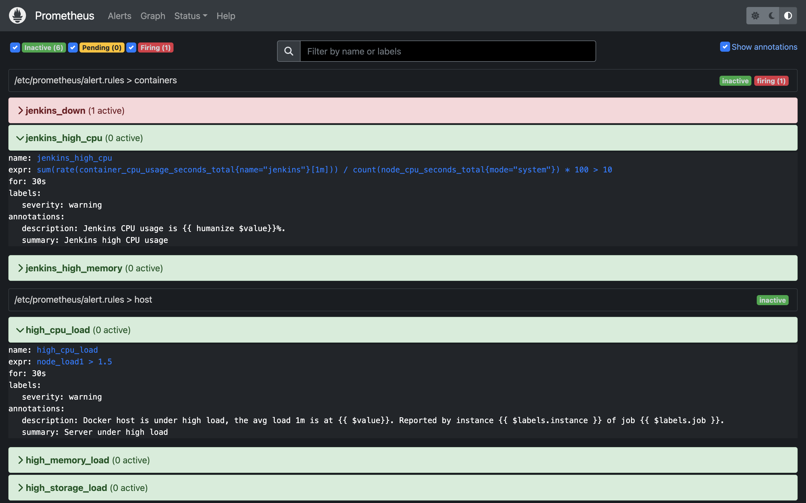
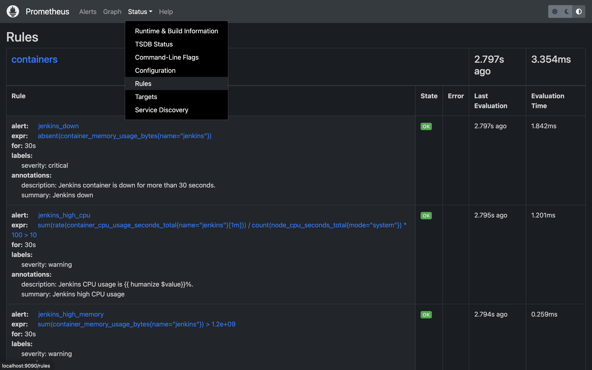
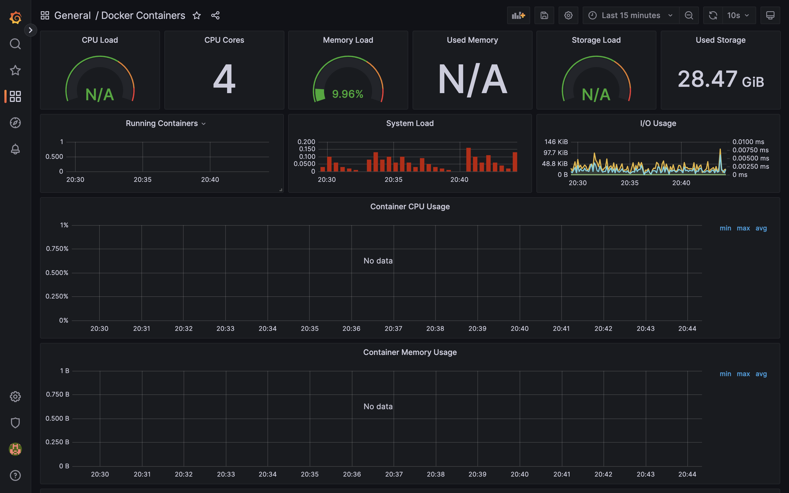
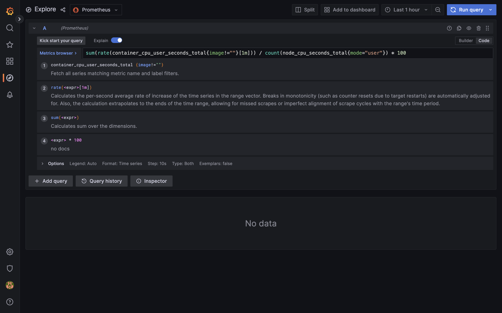

## **Выполнение задания**:

1. Колнируем репозиторий Штефана Продана- https://github.com/stefanprodan/dockprom
2. Собираем (там и без того все уже собрано)
3. Поднимаем `docker-compose up -d`
4. Проверяем, что всё работает через `docker ps` 
так же все работает в дашборде docker desktop  и в pycharm 
5. Логинимся в Prometheus и изучаем настроенные alerts, rules  
в интерфейсе __alerts__ видим 7 алертов в своих разделах с расчитанными на PromQL метриками 
эти же 7 алертов со своими порогами срабатывания содержатся в rules в аналогичных разделах 
6. Логинимся в Grafana
7. Смотрим, что настроено в дашбордах и explore
Дошборды разбиты на группы согласно конфигурационным файлам из предложенного репозитория
    - Docker Containers  
    - Docker Host  
    - Monitoring Services  
    - Ngnix

Более подробно на дашборде __Docker Containers__ расположены визуализации использования ресурсов контейнеров 
в разделе __Explore__ пошагово описаны расчеты метрик 