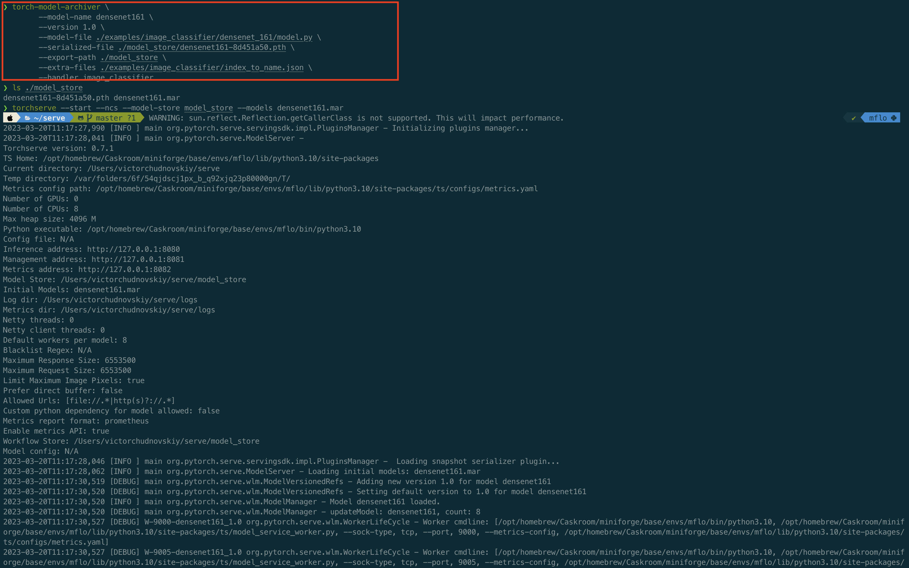
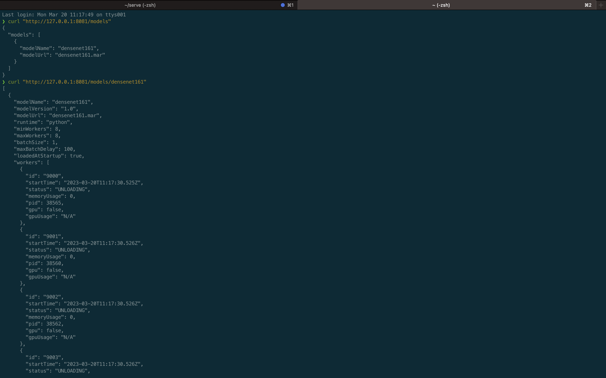

**Ход выполнения задания**
(есть ограничение. мое оборудование - mac OSX M1)
1. Клонирую репозиторий `git clone https://github.com/pytorch/serve.git`
2. Перехожу в эту директорию `cd serve`
3. В этой директории активирую ранее созданное конда окружение `conda activate depml`
4. Т.к `conda install` работает не со всеми пакетами зависимости устанавливаю через  
`pip3 install torchserve torch-model-archiver torch-workflow-archiver`. Вторая команда `yum install java-11-openjdk-devel` на маке __работать не будет__
5. Создаю папку `mkdir model_store` перехожу туда
6. Находясь в директории /model_store скачиваю модель `wget https://download.pytorch.org/models/densenet161-8d451a50.pth`
7. Возвращаюсь в папку `serve` и запускаю команду
`torch-model-archiver --model-name densenet161 --version 1.0 --model-file ./examples/image_classifier/densenet_161/model.py --serialized-file ./model_store/densenet161-8d451a50.pth --export-path ./model_store --extra-files ./examples/image_classifier/index_to_name.json --handler image_classifier`  
8. Проверяю то модель заархивирована и находится в нужной папке `ls ./model_store` и следом стартую сервер `torchserve --start --ncs --model-store model_store --models densenet161.mar` 
9. В итоге, по указанному хосту наблюдаем модель 